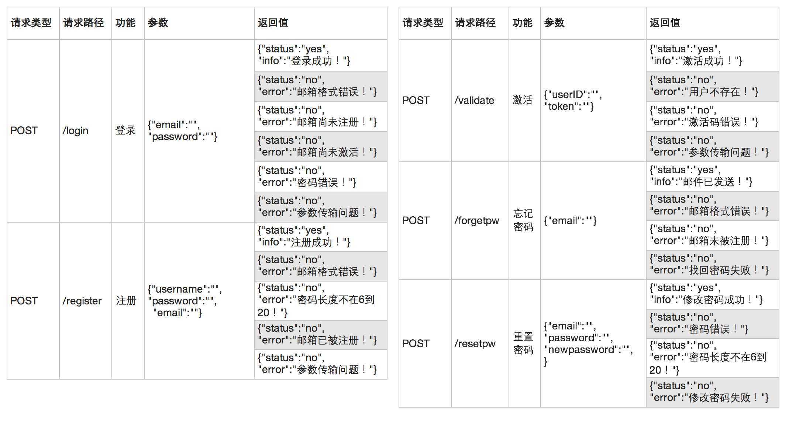

# hi-net-login-server

Login server for Hi Net


## Server Port

**application.yml**

```java
server:
  port: 8011
```


## Database

**application.yml**

```java
url: jdbc:mysql://127.0.0.1:3306/dbtemp?characterEncoding=utf8&useSSL=true
```

**待修改成云端数据库**


## corsFilter

**MyConfiguration.java**

```java
config.addAllowedOrigin("http://localhost:8080");
```

**待修改成允许网站的域名**


## API



